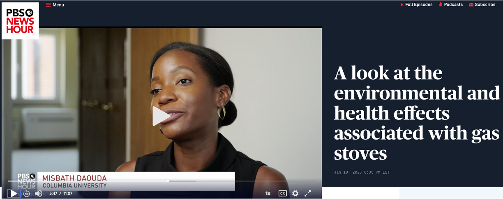

# REINE Lab
### Resilience, Energy, and Inequity in Neighborhood Environments

The REINE Lab studies how environmental exposures and adaptation to a changing climate shape health and health equity in the United States and globally. Our research examines the health implications of clean energy transitions, extreme heat, power outages, and other climate-related environmental disruptions, with a focus on populations disproportionately affected by environmental and energy burdens. We combine environmental epidemiology, exposure science, causal inference, data science, and qualitative methods to generate evidence that informs equitable climate, energy, and public health policy.

We are based in the Division of Environmental Health Sciences at the University of California, Berkeley School of Public Health.

### Recent highlights

- **April 2026** — Misbath Daouda was featured in The Guardian on the shift from gas to induction stoves in New York, discussing findings from her research on how switching from gas to electric cooking cuts indoor nitrogen dioxide exposure. [Read "Why thousands of New Yorkers swap gas for induction stoves in clean energy push"](https://www.theguardian.com/environment/2026/apr/02/new-york-induction-stoves-climate-energy)

