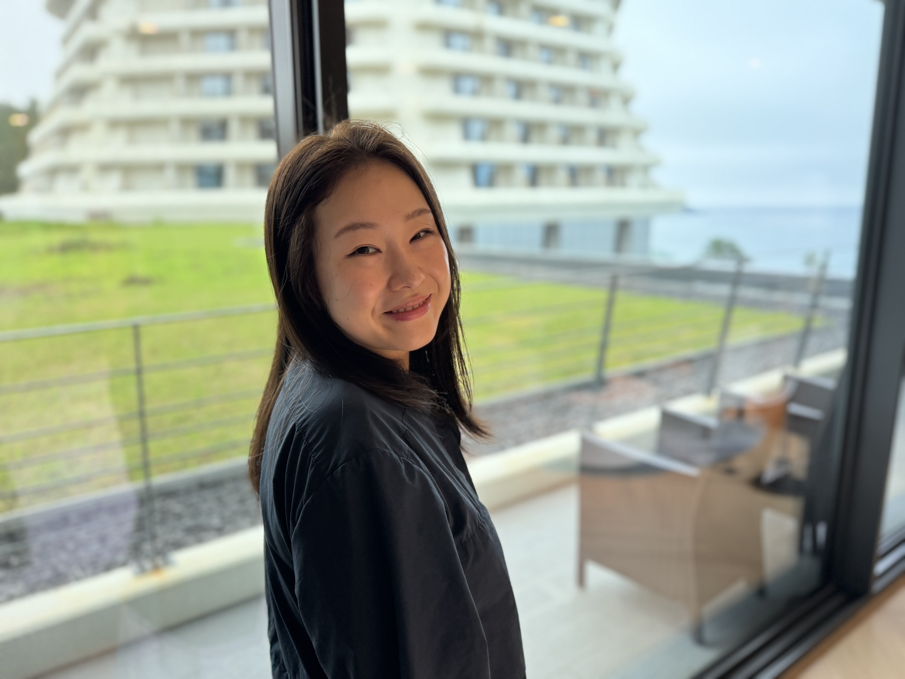
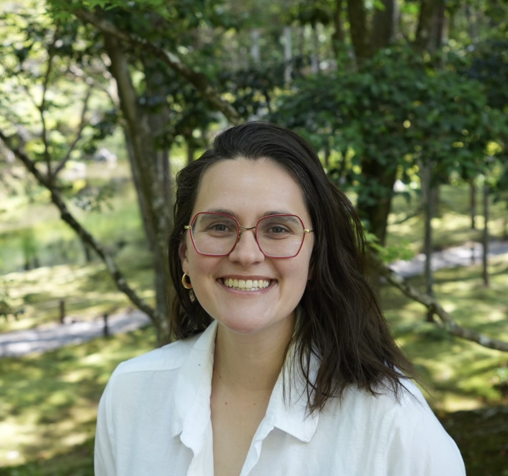
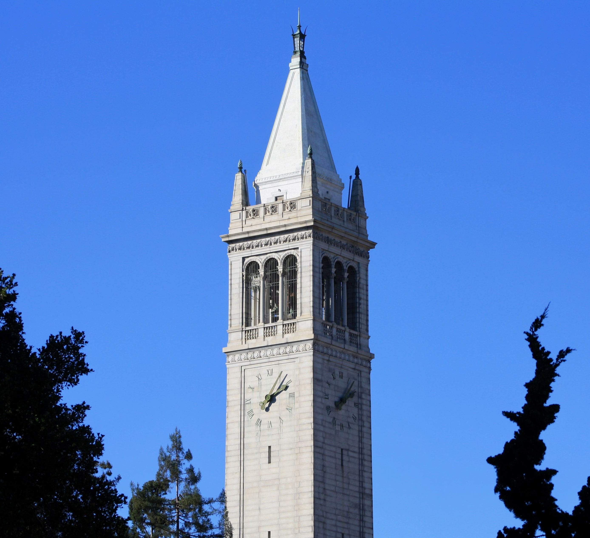

# People

## Principal Investigator

::: {.person-block}

### Misbath Daouda, PhD
Assistant Professor of Environmental Health Sciences

Misbath Daouda is an Assistant Professor of Environmental Health Sciences whose interdisciplinary research focuses on the health equity implications of climate adaptation strategies in the US and in West Africa.

[CV](files/cv.pdf) · [Google Scholar](https://scholar.google.com/citations?user=Il6VafQAAAAJ&hl=en) · [LinkedIn](https://linkedin.com/in/misbath-daouda-007089103)
:::

## Lab Members

::: {.person-block}

### Chai Yoon Um, PhD
Postdoctoral Researcher

Chai is a postdoctoral researcher focusing on how buildings, mechanical systems, and human activities influence the properties of indoor air and affect human health. She began working with Prof. Daouda in September 2026 on the "Cooking and Clean Air in Homes" study, measuring air pollutant concentrations and exposures resulting from cooking with gas, conventional electric, and induction burners in apartments and homes in disadvantaged or low-income communities. Chai received her PhD in Architecture from the BSTS program at UC Berkeley in 2026. She conducted her PhD research at Lawrence Berkeley National Laboratory, focusing on air mixing and pollutant dispersion in indoor environments relevant to airborne transmission and control. Outside of work, Chai enjoys hot yoga and taking walks with her dog, Bella.
:::

::: {.person-block}

### Jacqueline (Jackie) Holstein
Doctoral Student, Environmental Health Sciences

Jackie is an Environmental Health Sciences doctoral student who started working in the REINE Lab in 2025 following a decade-long career in clinical research development and management. Her research focuses on energy transitions, large-scale power outages, and their impact on perinatal and infant health. Using environmental epidemiology and quasi-experimental methods, she aims to highlight energy insecurity disparities and drive equitable energy policy change. Jackie completed her MPH in Global Epidemiology with a certificate in maternal and child health at the Rollins School of Public Health, Emory University. Outside of work, Jackie enjoys backpacking, inventing new cake recipes, and quilting.
:::

::: {.person-block}

### Anna Devereaux
MPH Candidate, Health Policy and Management

Anna is a second-year MPH candidate in the Health Policy and Management program. She is interested in learning how healthcare systems can be better equipped to address heat stress and environmental health disparities in low-income communities using environmental screening diagnostics and physician curriculum reform. She joined the REINE Lab in 2026 and works on the "New Moms" project, evaluating how participants experience heat and household energy needs during pregnancy, and identifying concerns related to energy challenges, adaptive strategies, and perceived solutions. In her free time, she enjoys creative writing, hiking, and camping, and is excited to explore more backpacking trails in Northern California this year.
:::

::: {.person-block}

### Siviwe Dlamini
Master's Student, Development Practice (Goldman School of Public Policy)

Siviwe received her B.A. in Environmental Studies and Psychology from St. Olaf University. She is a second-year student in the Master of Development Practice program at the Goldman School of Public Policy at UC Berkeley. Her research interests span climate adaptation and building household resilience to the impacts of climate change. She started working with Professor Daouda in 2026 on a project analyzing the drivers of the distribution of incentivized heat pump installations across California through the TECH Clean incentive programs. She enjoys going on hikes in her free time — and dislikes donuts.
:::

::: {.person-block}

### Medha Garapati
Undergraduate Research Assistant, Integrative Biology

Medha is a second-year undergraduate student majoring in Integrative Biology and minoring in Disability Studies. She is interested in identifying how environmental exposures such as heat stress can affect health outcomes in underserved communities. She joined the REINE Lab in 2026, working on the "New Moms" project, where she analyzed interviews to understand heat exposure, household energy needs, and the experience of pregnant individuals in these households. In her free time, Medha enjoys working out, practicing yoga, crocheting, cooking, and making different types of matcha.
:::

::: {.person-block}

### Alan Qiu
Undergraduate Research Assistant, Applied Mathematics

Alan is an undergraduate student at UC Berkeley majoring in Applied Mathematics with a minor in Statistics. He is interested in integrating mathematical and statistical methods into the field of public health. Alan joined the REINE Lab in 2026 and is currently working to leverage satellite climate data to examine the relationship between heat exposure and birth outcomes in the HAPIN trial. Outside of lab, Alan enjoys rock climbing and playing table tennis.
:::

## Alumni

- [Name] ([Role], [Years]) — now at [Current Position]
