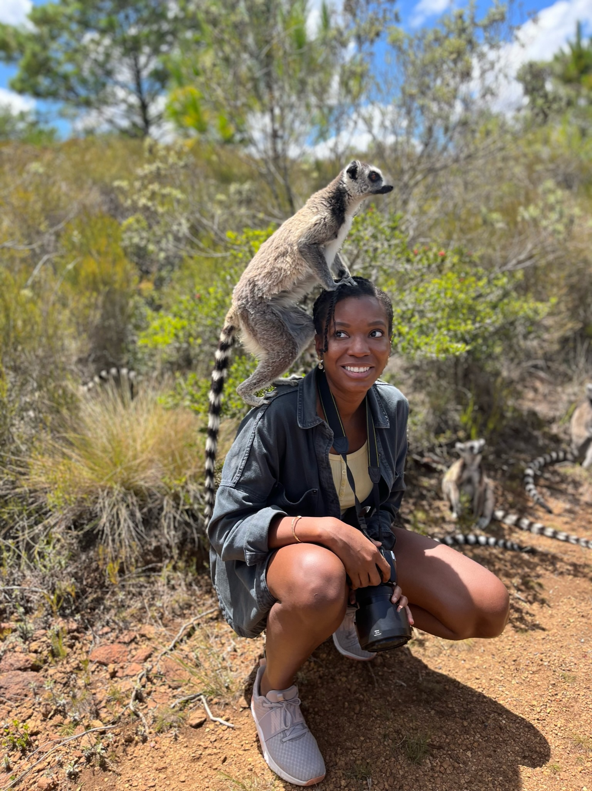
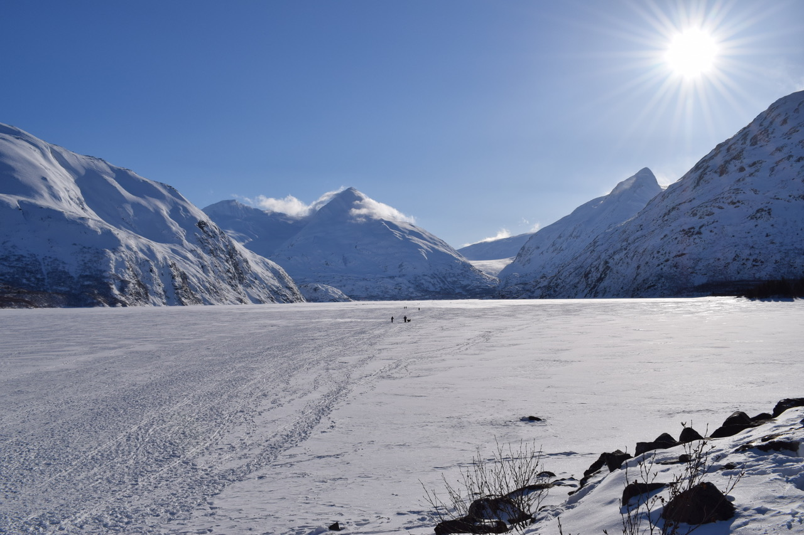

# Photography

Fieldwork and travel, through the lens.

#### Yosemite National Park, 2022

#### Tanzania, 2021

#### Tanzania, 2021

#### New York City, 2021

#### Paris, 2021

#### Madagascar, 2019

#### Madagascar, 2019

#### Alaska, 2018

#### Alaska, 2018

#### [Location, year]

#### [Location, year]

